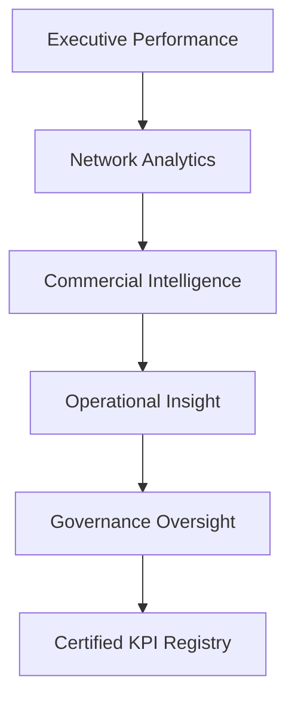

# ✈️ Enterprise Airline Analytics

## Federated Analytics & Governance Operating Model


---

# 🧭 Project Overview

This repository simulates a **governed federated analytics environment** for an airline enterprise.

It demonstrates how a centralized **Analytics Centre of Excellence (CoE)** can enable domain autonomy while maintaining **enterprise-wide KPI consistency, governance discipline, and semantic integrity**.

The project models a realistic analytics environment spanning:

* Executive performance monitoring
* Route and network profitability analysis
* Customer and commercial intelligence
* Operational reliability diagnostics
* KPI governance oversight

The objective is not to showcase dashboards alone.

It demonstrates **how enterprise analytics systems are designed, governed, and scaled in federated organizations.**

---

# 🎯 The Enterprise Problem

Large organizations rarely fail because they lack dashboards.

They fail because they lack **consistent definitions of performance**.

In federated environments:

* Finance calculates margin one way
* Commercial calculates margin another
* Operations optimizes different metrics entirely

Over time this leads to:

* conflicting executive reports
* declining trust in analytics
* inconsistent decisions

This repository demonstrates a **governance-driven operating model** that prevents metric drift while preserving domain autonomy.

---

# 🏛️ Federated Analytics Operating Model

The architecture separates domain insight layers while enforcing centralized governance.

Executive → Network → Commercial → Operations

All domains resolve to a **certified KPI registry**.



This model enables:

* domain specialization
* KPI consistency
* executive trust
* scalable analytics governance

---

# 📊 Live Interactive Dashboard

A fully interactive Power BI dashboard is available via GitHub Pages.

**View the dashboard:**

👉 https://awesomeanil.github.io/Federated-Insights-Case-Study/

The report demonstrates:

* Executive performance monitoring
* Route profitability diagnostics
* Customer segmentation insights
* Operational reliability analysis
* KPI governance visibility

---

# 📄 Published Dashboard Export

A static export of the Power BI report is available:

[Airline Insights PDF](reports/Airline%20Insights.pdf)

This file provides a **snapshot of the federated analytics environment**.

---

# 🧠 Enterprise Architecture

The repository models a modern analytics stack built on **Microsoft Fabric**.

Architecture flow:

Synthetic Data → Lakehouse → Delta Tables → Semantic Model → Governed Reporting

Key architectural principles:

* Lakehouse-based storage
* Delta table persistence
* governed semantic modeling
* certified KPI registry
* federated domain reporting

Detailed architecture documentation:

[Architecture Overview](docs/airline_architecture_overview.md)

---

# 🧱 Governed Semantic Model

The semantic layer integrates commercial demand, operational execution, and financial cost structure into a unified enterprise model.

### Core fact tables

* Fact_Bookings
* Fact_Flights
* Fact_Financials

### Supporting dimensions

* Dim_Date
* Dim_Route
* Dim_FareClass
* Dim_CustomerSegment
* Dim_Aircraft
* Dim_KPI_Definitions

Full semantic model documentation:

[Semantic Model Documentation](docs/airline_semantic_model.md)

---

# 📊 Dashboard Architecture

The analytics environment is structured as **five domain dashboards**.

### Executive Dashboard

Enterprise performance monitoring.

**Key metrics**

* Revenue
* Route Profit
* Profit Margin
* Demand Momentum
* Forecast Accuracy

---

### Route & Network Analytics

Supports network planning and fleet allocation.

**Key insights**

* route profitability
* margin compression
* demand efficiency
* volatility risk

---

### Customer & Commercial Intelligence

Analyzes revenue quality and segmentation behavior.

**Key insights**

* premium revenue share
* yield per passenger
* booking lead time
* segment demand shifts

---

### Operational Insights

Monitors reliability and execution stability.

**Key insights**

* load factor
* on-time departure
* cancellation rate
* disruption patterns

---

### KPI Governance Dashboard

Simulates a mature **Analytics CoE governance layer**.

Tracks:

* KPI certification coverage
* ownership accountability
* semantic grain alignment
* registry integrity

---

# 🛡️ KPI Governance Framework

Federated analytics requires structural governance.

Each KPI in the model declares:

* Business definition
* Calculation logic
* Owner
* Data steward
* Calculation grain
* Refresh SLA
* Quality rule status
* Certification status

Lifecycle:

```
Draft → Under Review → Certified → Deprecated
```

Governance documentation:

[Governance Operating Model](docs/GOVERNANCE_OPERATING_MODEL.md)

---

# ⚙️ Platform & Technology Stack

| Layer           | Technology                 |
| --------------- | -------------------------- |
| Data Generation | Python (Google Colab)      |
| Storage         | Microsoft Fabric Lakehouse |
| Persistence     | Delta Tables               |
| Transformation  | Fabric Dataflows           |
| Semantic Model  | Power BI Desktop           |
| Reporting       | Power BI                   |
| Documentation   | GitHub Pages               |

---

# 📂 Repository Structure

```
data/
   Dimension and fact tables
   Synthetic airline dataset

docs/
   Architecture documentation
   Governance framework
   Dashboard design specifications
   Presentation narrative

reports/
   Exported Power BI report

README.md
   Project overview
```

---

# 🧪 Synthetic Dataset

All data used in this repository was **programmatically generated using Python**.

The dataset simulates:

* airline bookings
* route-level operations
* financial cost structure
* customer segmentation behavior
* KPI governance registry

Synthetic data ensures:

* realistic analytical patterns
* reproducibility
* safe public sharing

---

# 📖 Suggested Reading Path

### Quick Overview

1️⃣ Executive Brief
2️⃣ Interactive Dashboard
3️⃣ Architecture Overview

---

### Governance Deep Dive

1️⃣ Governance Framework
2️⃣ KPI Registry Model
3️⃣ Contribution Process

---

### Technical Architecture Review

1️⃣ Configuration Guide
2️⃣ Semantic Model
3️⃣ Dashboard Architecture

---

# 👤 Author

**Anil Jacob**

Analytics & Governance Leader
Microsoft Fabric | Semantic Modeling | Enterprise BI Architecture

GitHub
https://github.com/AwesomeAnil

LinkedIn
https://linkedin.com/in/anil-jacobs

---

# 💡 Closing Perspective

Federated analytics enables domain expertise and faster decisions.

But without governance, federation becomes fragmentation.

This project demonstrates how **semantic discipline, KPI certification, and clear ownership structures allow federated analytics to scale responsibly within enterprise environments.**
