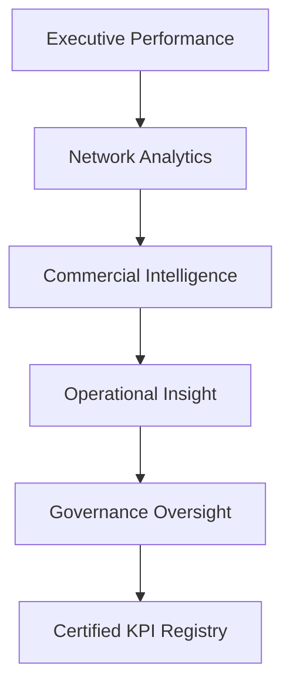

# ✈️ Enterprise Airline Analytics

## Federated Analytics & Governance Operating Model


---

# 🧭 Project Overview

This repository simulates a **governed federated analytics environment** for an airline enterprise.

It demonstrates how a centralized **Analytics Centre of Excellence (CoE)** can enable domain autonomy while maintaining **enterprise-wide KPI consistency, governance discipline, and semantic integrity**.

The project models a realistic analytics environment spanning:

* Executive performance monitoring
* Route and network profitability analysis
* Customer and commercial intelligence
* Operational reliability diagnostics
* KPI governance oversight

The objective is not to showcase dashboards alone.

It demonstrates **how enterprise analytics systems are designed, governed, and scaled in federated organizations.**

---

# 🎯 The Enterprise Problem

Large organizations rarely fail because they lack dashboards.

They fail because they lack **consistent definitions of performance**.

In federated environments:

* Finance calculates margin one way
* Commercial calculates margin another
* Operations optimizes different metrics entirely

Over time this leads to:

* conflicting executive reports
* declining trust in analytics
* inconsistent decisions

This repository demonstrates a **governance-driven operating model** that prevents metric drift while preserving domain autonomy.

---

# 🏛️ Federated Analytics Operating Model

The architecture separates domain insight layers while enforcing centralized governance.

Executive → Network → Commercial → Operations

All domains resolve to a **certified KPI registry**.



This model enables:

* domain specialization
* KPI consistency
* executive trust
* scalable analytics governance

---

# 📊 Live Interactive Dashboard

A fully interactive Power BI dashboard is available via GitHub Pages.

**View the dashboard:**

👉 https://awesomeanil.github.io/Federated-Insights-Case-Study/Airline%20Insights.html

The report demonstrates:

* Executive performance monitoring
* Route profitability diagnostics
* Customer segmentation insights
* Operational reliability analysis
* KPI governance visibility

---

# 📄 Published Dashboard Export

A static export of the Power BI report is available:

[Airline Insights PDF](reports/Airline%20Insights.pdf)

This file provides a **snapshot of the federated analytics environment**.

---

# 🧠 Enterprise Architecture

The repository models a modern analytics stack built on **Microsoft Fabric**.

Architecture flow:

Synthetic Data → Lakehouse → Delta Tables → Semantic Model → Governed Reporting

Key architectural principles:

* Lakehouse-based storage
* Delta table persistence
* governed semantic modeling
* certified KPI registry
* federated domain reporting

Detailed architecture documentation:

[Architecture Overview](docs/airline_architecture_overview.md)

---

# 🧱 Governed Semantic Model

The semantic layer integrates commercial demand, operational execution, and financial cost structure into a unified enterprise model.

### Core fact tables

* Fact_Bookings
* Fact_Flights
* Fact_Financials

### Supporting dimensions

* Dim_Date
* Dim_Route
* Dim_FareClass
* Dim_CustomerSegment
* Dim_Aircraft
* Dim_KPI_Definitions

Full semantic model documentation:

[Semantic Model Documentation](docs/airline_semantic_model.md)

---

# 📊 Dashboard Architecture

The analytics environment is structured as **five domain dashboards**.

### Executive Dashboard

Enterprise performance monitoring.

**Key metrics**

* Revenue
* Route Profit
* Profit Margin
* Demand Momentum
* Forecast Accuracy

---

### Route & Network Analytics

Supports network planning and fleet allocation.

**Key insights**

* route profitability
* margin compression
* demand efficiency
* volatility risk

---

### Customer & Commercial Intelligence

Analyzes revenue quality and segmentation behavior.

**Key insights**

* premium revenue share
* yield per passenger
* booking lead time
* segment demand shifts

---

### Operational Insights

Monitors reliability and execution stability.

**Key insights**

* load factor
* on-time departure
* cancellation rate
* disruption patterns

---

### KPI Governance Dashboard

Simulates a mature **Analytics CoE governance layer**.

Tracks:

* KPI certification coverage
* ownership accountability
* semantic grain alignment
* registry integrity

---

# 🛡️ KPI Governance Framework

Federated analytics requires structural governance.

Each KPI in the model declares:

* Business definition
* Calculation logic
* Owner
* Data steward
* Calculation grain
* Refresh SLA
* Quality rule status
* Certification status

Lifecycle:

```
Draft → Under Review → Certified → Deprecated
```

Governance documentation:

[Governance Operating Model](docs/GOVERNANCE_OPERATING_MODEL.md)

---

# ⚙️ Platform & Technology Stack

| Layer           | Technology                 |
| --------------- | -------------------------- |
| Data Generation | Python (Google Colab)      |
| Storage         | Microsoft Fabric Lakehouse |
| Persistence     | Delta Tables               |
| Transformation  | Fabric Dataflows           |
| Semantic Model  | Power BI Desktop           |
| Reporting       | Power BI                   |
| Documentation   | GitHub Pages               |

---

# 📂 Repository Structure

```
data/
   Dimension and fact tables
   Synthetic airline dataset

docs/
   Architecture documentation
   Governance framework
   Dashboard design specifications
   Presentation narrative

reports/
   Exported Power BI report

README.md
   Project overview
```

---

# 🧪 Synthetic Data Model

The repository includes a synthetic airline analytics dataset designed to simulate a realistic enterprise reporting environment.

The dataset was programmatically generated using Python in Google Colab to model common airline operational and commercial dynamics while remaining safe for public sharing.

The dataset supports analysis across three enterprise domains:

• Commercial demand and revenue  
• Operational flight performance  
• Financial cost structure  

The model intentionally mirrors a typical airline analytics warehouse.

---

## Fact Tables

### Fact_Bookings
Transaction-level booking data.

Grain: **One row per booking transaction**

Contains:

- Booking_Date
- Route_ID
- Fare_Class_ID
- Segment_ID
- Tickets_Sold
- Total_Revenue

Supports analysis of:

- revenue trends
- customer segmentation
- premium cabin demand
- booking lead-time behavior

---

### Fact_Flights
Operational flight performance.

Grain: **One row per flight per route per day**

Contains:

- Flight_Date
- Route_ID
- Aircraft_Type
- Seats_Capacity
- Seats_Sold
- Departure_Delay_Minutes
- Cancelled_Flag

Supports analysis of:

- load factor
- operational reliability
- disruption patterns
- execution stability

---

### Fact_Financials
Monthly cost structure for each route.

Grain: **Route × Month**

Contains:

- Fuel_Cost
- Staff_Cost
- Aircraft_Cost
- Maintenance_Cost
- Airport_Fees
- Total_Cost

Supports analysis of:

- route profitability
- cost volatility
- fuel exposure
- margin compression

---

## Dimension Tables

The dataset includes conformed dimensions used across the analytical domains.

| Dimension | Purpose |
|---------|--------|
| Dim_Date | calendar hierarchy and seasonality |
| Dim_Route | origin-destination network |
| Dim_FareClass | cabin class structure |
| Dim_CustomerSegment | passenger segmentation |
| Dim_Aircraft | fleet capacity characteristics |
| Dim_Airport | airport reference data |

These dimensions ensure consistent slicing across commercial, operational, and financial analyses.

---

## Governance Metadata

The dataset also includes governance metadata tables used by the KPI registry.

Examples include:

- Dim_KPI_Definitions
- Dim_KPI_Def_Gov_Align
- Dim_KPI_Def_Gov_Real

These tables simulate the **governed KPI registry used by the Analytics Centre of Excellence**.

They track:

- metric definitions
- ownership
- stewardship
- certification status
- calculation grain
- refresh SLA

---


# 📖 Suggested Reading Path

### Quick Overview

1️⃣ [Executive Brief](https://github.com/AwesomeAnil/Federated-Insights-Case-Study/blob/main/docs/EXEC_1PAGER.md)
2️⃣ [Interactive Dashboard](https://awesomeanil.github.io/Federated-Insights-Case-Study/Airline%20Insights.html)
3️⃣ [Architecture Overview](https://github.com/AwesomeAnil/Federated-Insights-Case-Study/blob/main/docs/airline_architecture_overview.md)

---

### Governance Deep Dive

1️⃣ [Governance Framework](https://github.com/AwesomeAnil/Federated-Insights-Case-Study/blob/main/docs/GOVERNANCE_OPERATING_MODEL.md)
2️⃣ [KPI Governance](https://github.com/AwesomeAnil/Federated-Insights-Case-Study/blob/main/docs/kpi_governance_report_design.md)
3️⃣ [Contributing](https://github.com/AwesomeAnil/Federated-Insights-Case-Study/blob/main/docs/Contributing.md)

---

### Technical Architecture Review

1️⃣ [Configuration Guide](https://github.com/AwesomeAnil/Federated-Insights-Case-Study/blob/main/docs/Configuration.md)
2️⃣ [Semantic Model](https://github.com/AwesomeAnil/Federated-Insights-Case-Study/blob/main/docs/airline_semantic_model.md)
3️⃣ [Dashboard Architecture](https://github.com/AwesomeAnil/Federated-Insights-Case-Study/blob/main/docs/dashboard_architecture_overview.md)

---

# 👤 Author

**Anil Jacob**

Analytics & Governance Leader
Microsoft Fabric | Semantic Modeling | Enterprise BI Architecture

GitHub
https://github.com/AwesomeAnil

LinkedIn
https://linkedin.com/in/anil-jacobs

---

# 💡 Closing Perspective

Federated analytics enables domain expertise and faster decisions.

But without governance, federation becomes fragmentation.

This project demonstrates how **semantic discipline, KPI certification, and clear ownership structures allow federated analytics to scale responsibly within enterprise environments.**
