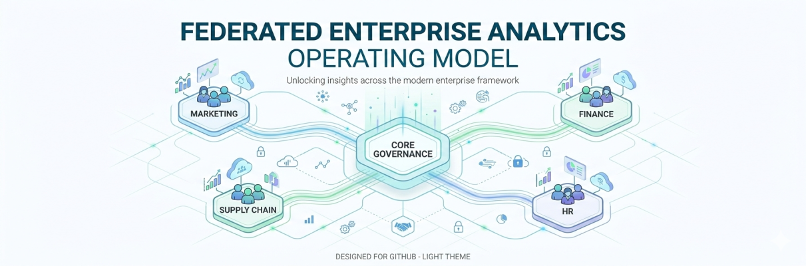
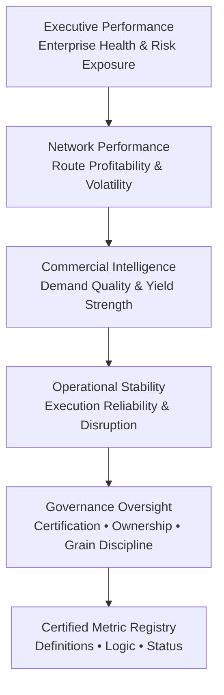
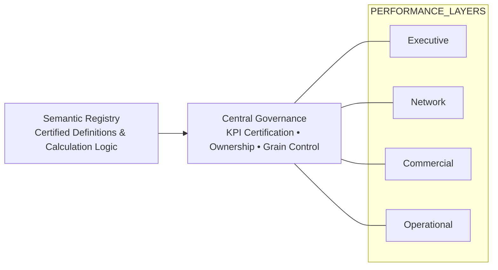
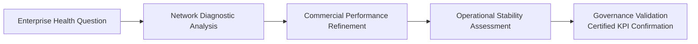

# Federated Enterprise Analytics — Operating Model

## Why Federated Insights?

Modern enterprises do not suffer from a lack of dashboards.  
They suffer from:

- Metric inconsistency  
- Cross-domain fragmentation  
- Conflicting definitions of performance  
- Unclear KPI ownership  
- Executive decisions made on non-certified metrics  

**Federated Insights addresses this problem.**

It is an analytics operating model where:

- Performance domains (Executive, Network, Commercial, Operational) are structurally separated  
- KPIs are centrally certified and governed  
- Metric definitions are standardized and transparent  
- Governance operates across domains rather than inside them  

Federation does not mean decentralization.  
It means controlled domain autonomy under shared governance.

This repository demonstrates how a Centre of Excellence (CoE) can implement a federated insight model with certification discipline and semantic control.

---

## Federated Insight Model (Structural View)

This model separates performance domains while anchoring them to centralized governance and a certified metric foundation.

### Board-Level Signal

- Insight is layered and domain-specific  
- Governance is explicit and structured  
- Metrics are anchored to a certified registry  
- The model prevents cross-domain ambiguity  

This is not a collection of dashboards.  
It is a governed analytics ecosystem.

---

## Governance Overlay Model

Governance does not sit at the end of reporting.  
It operates across all insight layers simultaneously.

### Board-Level Signal

- Governance is cross-cutting, not isolated  
- Every domain operates under certified KPI control  
- Ownership and calculation grain are transparent  
- Semantic integrity is enforced centrally  

This model reflects how mature Analytics CoEs operate in large enterprises.

---

## Insight Consumption Flow

Federated insights follow a structured decision logic from enterprise health to operational control — validated by governance.

### Board-Level Signal

- Executive questions drive structured diagnostic layers  
- Insights move from strategic to operational depth  
- Governance validates conclusions before decision execution  

This prevents fragmented decision-making and inconsistent performance narratives.
