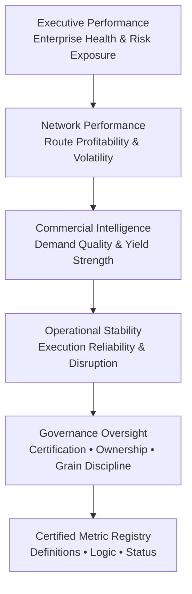
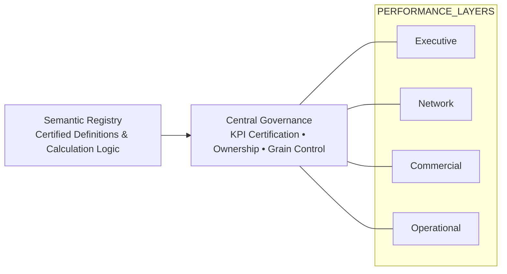
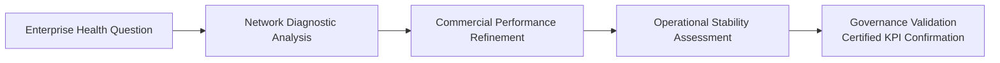

# ✈️ Federated Enterprise Analytics — Governance-Driven Operating Model

## 🧭 Why Federated Insights?

Modern enterprises do not fail because they lack data.  
They fail because they lack governed interpretation of data.

Dashboards proliferate.  
Definitions drift.  
Domains operate in silos.  
KPIs become negotiable.

Executive confidence erodes.

This repository does not showcase dashboards.

It demonstrates a governed federated analytics operating model designed to prevent those failures.

**Federated Insights addresses this problem.**

It is an analytics operating model where:

- Performance domains (Executive, Network, Commercial, Operational) are structurally separated  
- KPIs are centrally certified and governed  
- Metric definitions are standardized and transparent  
- Governance operates across domains rather than inside them  

Federation does not mean decentralization.  
It means controlled domain autonomy under shared governance.

This repository demonstrates how a Centre of Excellence (CoE) can implement a federated insight model with certification discipline and semantic control.

---

## 🧭 What Federated Insights Really Means

Federated insights is **not decentralization**.

It is **controlled autonomy**.

Each enterprise domain — Executive, Network, Commercial, Operational — retains analytical depth and domain expertise.

But no domain is allowed to redefine performance independently.

All insights resolve to:

- A certified KPI registry  
- Clearly defined ownership  
- Explicit data stewardship  
- Enforced grain discipline  
- Transparent lineage  
- SLA-aligned freshness controls  

Federation without governance becomes fragmentation.  
Governance without federation becomes bureaucracy.

This model balances both.

## 🏛️ The Federated Operating Model

This is a **layered decision system** — not a report stack.

### 📢 What This Signals

- Insights are layered intentionally  
- Domains are separated by responsibility  
- Governance is explicit — not implied  
- Metrics anchor to a certified semantic foundation  

This is how an Analytics Centre of Excellence scales insight without sacrificing control.

---

## 🛡️ Governance Is an Overlay — Not a Page

In many organizations, governance appears as a compliance document.

Here, governance is operationalized.

It overlays every domain simultaneously.

### 📢 What This Demonstrates

- KPI Owners (functional heads) retain definitional authority  
- Data Stewards (lead analysts) operationalize and safeguard metric integrity  
- Certification status is visible  
- Refresh SLAs are tracked  
- Grain alignment is enforced  
- Source lineage is transparent  

Governance is embedded into the insight lifecycle — not reviewed after the fact.

----

## 🏗️ Federated Insight Model (Structural View)

This model separates performance domains while anchoring them to centralized governance and a certified metric foundation.

### 📢 Board-Level Signal

- Insight is layered and domain-specific  
- Governance is explicit and structured  
- Metrics are anchored to a certified registry  
- The model prevents cross-domain ambiguity  

This is not a collection of dashboards.  
It is a governed analytics ecosystem.

---

## 🛡️ Governance Overlay Model

Governance does not sit at the end of reporting.  
It operates across all insight layers simultaneously.

### 📢 Board-Level Signal

- Governance is cross-cutting, not isolated  
- Every domain operates under certified KPI control  
- Ownership and calculation grain are transparent  
- Semantic integrity is enforced centrally  

This model reflects how mature Analytics CoEs operate in large enterprises.

---

## 🔄 Insight Consumption Flow

Federated insights follow a structured decision logic from enterprise health to operational control — validated by governance.

### 📢 Board-Level Signal

- Executive questions drive structured diagnostic layers  
- Insights move from strategic to operational depth  
- Governance validates conclusions before decision execution  

## 🔄 Structured Insight Consumption

Insights move intentionally from strategy to validation.

This flow prevents:

- Cross-domain metric conflicts  
- Shadow KPI creation  
- Inconsistent margin calculations  
- Uncertified executive reporting  

It enforces disciplined analytical reasoning.

---

## 📚 Governance Depth Implemented in This Repository

This project operationalizes governance through:

- Explicit separation of KPI Owner vs Data Steward  
- Certification tracking and coverage metrics  
- Data quality rule flags  
- Freshness SLA monitoring aligned to fact table cutoffs  
- Grain validation (Daily vs Monthly vs Composite)  
- Source table transparency  
- Calculation layer classification (Fact / Derived / Composite)  

It simulates how a mature CoE manages semantic risk.

---

## 🏢 Why This Matters to Enterprise Leadership

In federated environments:

- Commercial teams optimize yield  
- Finance protects margin  
- Operations stabilizes execution  
- Network teams manage capacity  

Without governance, each domain can redefine performance.

This model ensures:

**One definition of revenue.**  
**One definition of margin.**  
**One certified source of truth.**

At scale.

---

## 🚀 What This Repository Represents

This is not a technical infrastructure blueprint.

It is an operating model demonstration of:

- Federated analytics design  
- Semantic governance discipline  
- Cross-domain control architecture  
- Enterprise KPI certification strategy  
- Structured decision-layer logic  

It reflects how modern analytics leaders build systems that scale insight without sacrificing integrity.
