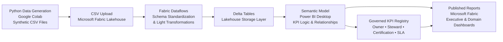

# ⚙️ Configuration Guide  
## ☁️ Federated Analytics & Governance Environment

---

## 🎯 1. Purpose

This document defines the technical and modeling configuration of the federated analytics environment represented in this repository.

It clarifies:

- Data origin  
- Platform architecture  
- Storage conventions  
- Modeling standards  
- Governance enforcement points  
- Environmental boundaries  

The objective is transparency and reproducibility — not infrastructure documentation.

---

## 📦 2. Repository Scope

This repository simulates a governed federated analytics operating model in an airline context.

It demonstrates:

- Synthetic transaction-level booking data  
- Microsoft Fabric Lakehouse storage  
- Delta table persistence  
- Semantic modeling in Power BI Desktop  
- Governance-driven KPI certification  
- Executive and domain reporting  

It does **not** simulate:

- Live enterprise production systems  
- Real-time streaming pipelines  
- Operational ERP integrations  
- Confidential airline datasets  

The focus is governance and semantic control within a modern cloud analytics stack.

---

## 🧪 3. Data Generation

All datasets were programmatically generated using Python in Google Colab.

Synthetic data was created to simulate:

- Airline booking transactions  
- Route-level performance  
- Revenue and passenger metrics  
- Customer segmentation attributes  

Synthetic generation ensures:

- Structural realism  
- Reproducibility  
- Safe public sharing  
- No exposure of proprietary data  

Generated datasets were exported as CSV files prior to ingestion into Microsoft Fabric.

---

## 🔄 4. End-to-End Data Flow

The execution path flows from synthetic generation to governed reporting.

This flow demonstrates:

- Modern Lakehouse architecture  
- Delta persistence  
- Semantic-layer governance enforcement  
- Registry-controlled reporting  

Governance operates at the semantic layer before insights reach executive dashboards.

---

## 🗄️ 5. Data Storage – Microsoft Fabric Lakehouse

CSV files generated in Google Colab were uploaded to Microsoft Fabric Lakehouse storage.

The Lakehouse functions as the centralized storage layer for:

- Raw CSV ingestion  
- Structured fact persistence  
- Delta table storage  

Delta format provides:

- ACID compliance  
- Versioning support  
- Structured query performance  
- Reliable semantic model consumption  

This mirrors modern medallion-style architecture, simplified for demonstration.

---

## 🔧 6. Transformation Layer – Fabric Dataflows

Fabric Dataflows were used to:

- Ingest CSV files  
- Apply light transformations  
- Standardize schema  
- Enforce naming conventions  
- Load curated tables into Delta format  

Transformations are intentionally minimal.

The purpose of this repository is governance modeling — not ETL complexity.

---

## 🧠 7. Semantic Modeling – Power BI Desktop

Semantic models were built using Power BI Desktop.

This layer defines:

- KPI measures  
- Calculation logic  
- Relationship modeling  
- Fact vs Derived vs Composite classification  
- Grain declarations (Daily / Monthly / Composite)  

All governance enforcement operates at this semantic layer.

This is where:

- Certification status is applied  
- Owner vs Steward roles are defined  
- SLA visibility is surfaced  
- Grain discipline is enforced  

---

## 📊 8. Reporting & Publication – Microsoft Fabric

Reports were published to Microsoft Fabric.

The reporting layer includes:

- Executive dashboards  
- Domain-level analytics views  
- KPI Governance page  

Only Certified KPIs are permitted in executive reporting views.

This enforces governance discipline operationally.

---

## 🧾 9. Fact Table Assumptions

Primary transaction source:

**Fact_Bookings**

Assumptions:

- Transaction-level grain  
- One row per booking  
- Includes revenue, passenger count, route, and booking date  
- Serves as the foundation for derived and composite KPIs  

Additional financial or operational datasets are conceptually modeled but simplified for governance clarity.

---

## ⏱️ 10. Data Cutoff & Refresh Alignment

All freshness and SLA tracking aligns to:

**Final Booking Fact Date: 31/12/2024**

This date represents the final available transaction record in the bookings fact table.

All freshness indicators are evaluated relative to this cutoff.

This prevents artificial timeliness drift in governance reporting.

---

## 🧩 11. Grain Conventions

Each KPI must explicitly declare grain:

- Daily  
- Monthly  
- Composite  

Daily grain aligns with transaction-level booking data.  
Monthly grain aligns with calendar aggregation.  
Composite metrics combine multiple dependent KPIs.

Cross-grain aggregation without declaration is not permitted.

Grain discipline prevents silent misinterpretation.

---

## 🏗️ 12. Calculation Layer Classification

Each KPI is categorized as:

- Fact — Direct aggregation from transaction data  
- Derived — Ratio or calculated transformation  
- Composite — Multi-source or multi-KPI calculation  

This classification ensures semantic clarity and avoids duplication.

---

## 📅 13. Refresh & SLA Standards

Each KPI declares:

- Expected Refresh Frequency  
- Last Refresh Date  
- Freshness Status (On-Time / Delayed)  

Freshness status is evaluated relative to:

- Declared SLA  
- 31/12/2024 data cutoff  

SLA visibility protects executive reporting integrity.

---

## 📚 14. Governance Registry Standards

All KPIs must:

- Exist in the certified KPI registry  
- Declare KPI Owner  
- Declare Data Steward  
- Define source table  
- Declare grain  
- Declare calculation layer  
- Indicate quality rule presence  

No KPI may bypass registry governance controls.

---

## 🚧 15. Environmental Boundaries

This repository represents a simulated internal Analytics CoE environment.

It demonstrates:

- Federated insight structuring  
- Governance lifecycle discipline  
- Semantic modeling rigor  
- Data quality visibility  
- Platform-aware architecture  

It does **not** represent:

- A live production deployment  
- Confidential enterprise infrastructure  
- Operational airline systems  

All modeling decisions are illustrative of enterprise governance principles within a modern Microsoft Fabric environment.

---

## 💡 Closing Perspective

This configuration reflects a realistic, modern analytics stack:

**Synthetic Data → Lakehouse → Delta → Semantic Model → Governed Reporting**

Governance is enforced at the semantic layer before insight reaches decision-makers.

The result is a federated analytics environment that balances:

- Autonomy  
- Control  
- Transparency  
- Scalability  

Without unnecessary technical complexity.
