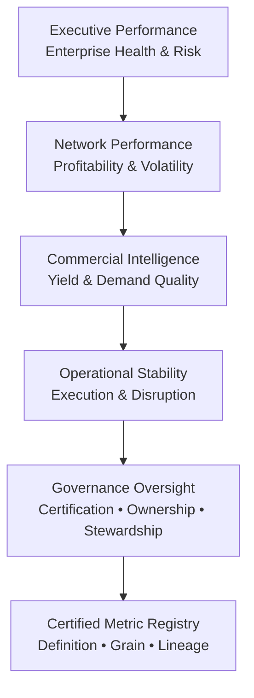

# ✈️ Federated Enterprise Analytics  
## 🏛️ Governance-Driven Insight Operating Model — Executive Brief

---

## ❗ The Problem

Enterprises rarely lack dashboards.  
They lack governed interpretation of performance.

When KPIs are redefined across domains:

- Finance reports one margin  
- Commercial reports another  
- Operations optimizes a third  

Executives lose confidence.

Federated environments amplify this risk.

Without disciplined governance, decentralization becomes fragmentation.

---

## 🛡️ The Solution: Federated Insights Under Governance

This operating model separates analytical domains while enforcing centralized KPI control.

It ensures:

- Domain autonomy without definitional drift  
- Certified KPIs across executive, network, commercial, and operational layers  
- Clear ownership and stewardship accountability  
- Enforced grain discipline (Daily / Monthly / Composite)  
- Data quality rule visibility  
- SLA-aligned freshness tracking  
- Transparent source lineage  

Federation is preserved.  
Integrity is protected.

---

## 🏗️ Structural Model

This model separates insight layers while anchoring them to centralized governance.

Executive → Network → Commercial → Operational  

All insights resolve to:

- Certified KPI Registry  
- Defined Ownership  
- Explicit Stewardship  
- Enforced Semantic Control  

---

## ⚙️ Governance Model in Practice

Each KPI is governed through:

- **KPI Owner** — Functional head accountable for definition and approval  
- **Data Steward** — Lead analyst responsible for data integrity and operationalization  
- **Certification Status** — Certified vs Draft visibility  
- **Data Quality Rule Flag** — Control coverage indicator  
- **Freshness SLA & Status** — Timeliness governance aligned to fact data cutoff  
- **Calculation Layer Transparency** — Fact, Derived, or Composite  

This mirrors mature Analytics CoE operating models.

---

## 📊 Strategic Impact

This model prevents:

- KPI duplication across domains  
- Cross-grain ambiguity  
- Uncertified executive reporting  
- Shadow metric creation  
- Margin misinterpretation  

It enables:

- Executive confidence  
- Cross-functional alignment  
- Scalable governance maturity  
- Audit-ready semantic transparency  

---

## 📢 Leadership Signal

This repository demonstrates:

- Federated analytics architecture thinking  
- Governance-first KPI design  
- Domain separation with centralized control  
- Operationalized stewardship discipline  
- Structured insight consumption logic  

It reflects how enterprise analytics leaders design systems — not just dashboards.
