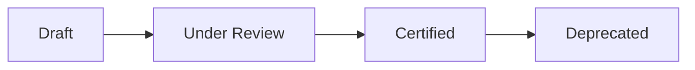

# 🛡️ Governance Framework  
## 🏛️ Federated Analytics & Insight Operating Model

---

## 🎯 1. Purpose

This document defines how KPIs are governed within a federated analytics environment.

In federated models, different domains own analytical depth.  
Without structured governance, metric definitions drift and executive trust declines.

This framework ensures:

- Consistent KPI definitions across domains  
- Clear accountability for business meaning  
- Operational stewardship for data integrity  
- Certification discipline  
- Grain alignment  
- Timeliness and quality visibility  

Governance exists to protect decision integrity — not to slow analytics.

---

## 🧭 2. Governance Principles

The operating model is built on five principles:

### 1️⃣ Single Definition per KPI  
Every KPI has one certified business definition.

### 2️⃣ Clear Role Separation  
Definition ownership and data stewardship are distinct responsibilities.

### 3️⃣ Visible Certification Status  
All KPIs are explicitly marked as Draft, Review, Certified, or Deprecated.

### 4️⃣ Grain Discipline  
KPIs must declare their calculation grain (Daily / Monthly / Composite).

### 5️⃣ Transparency of Source and Timeliness  
Every KPI documents its primary source and refresh expectations.

---

## 👥 3. Governance Roles & Responsibilities

### 👤 3.1 KPI Owner

Typically the functional head (e.g., Head of Finance, Head of Commercial).

**Accountable for:**

- Business definition approval  
- Certification sign-off  
- Cross-domain definition alignment  
- Resolution of metric conflicts  

The KPI Owner defines what the metric means.

### 🧑‍💼 3.2 Data Steward

Typically the lead analyst within the domain.

**Responsible for:**

- Maintaining calculation logic  
- Working with data engineering to operationalize metrics  
- Ensuring data quality rules are applied  
- Monitoring refresh SLAs  
- Flagging anomalies or definition risks  

The Data Steward ensures the metric works in practice.

### 🏢 3.3 Analytics CoE / Governance Oversight

**Responsible for:**

- Maintaining the KPI registry  
- Tracking certification coverage  
- Monitoring stewardship assignment  
- Ensuring grain alignment across domains  
- Preventing duplicate or shadow KPIs  

The CoE protects semantic integrity at scale.

---

## 🔄 4. KPI Lifecycle

Each KPI follows a defined lifecycle.

### 📝 Draft

- Initial definition created  
- Logic under development  
- Not permitted for executive reporting  

### 🔍 Under Review

- Owner and Steward validation underway  
- Cross-domain dependencies evaluated  
- Quality controls being defined  

### ✅ Certified

- Definition approved by KPI Owner  
- Steward operational controls confirmed  
- Grain validated  
- Source documented  
- SLA defined  

Permitted for executive reporting.

### 🗂️ Deprecated

- Replaced by a new definition  
- Retained for historical reference only  

---

## 📌 5. Certification Criteria

A KPI cannot be certified unless:

- Business definition is documented  
- Calculation logic is clearly defined  
- Primary source table is identified  
- Grain is declared  
- Data Steward is assigned  
- Refresh SLA is defined  
- Quality rule flag is documented  

Certification is structural, not cosmetic.

---

## 📊 6. Data Quality Controls

Governed KPIs require visibility into:

- Presence of defined quality rules  
- Timeliness relative to SLA  
- Known data limitations  
- Dependency on upstream systems  

This framework emphasizes:

Transparency over perfection.

Quality governance is about knowing risk — not eliminating all risk.

---

## ⏱️ 7. Freshness & Timeliness Standards

Each KPI declares:

- Expected Refresh Frequency (Daily / Monthly / Other)  
- Last Refresh Date  
- Current Freshness Status (On-Time / Delayed)  

In this repository, freshness is aligned to the final booking fact cutoff date:  
**31/12/2024**

Timeliness visibility prevents silent reporting risk.

---

## ⚙️ 8. Grain & Calculation Layer Governance

Each KPI declares:

- Grain (Daily / Monthly / Composite)  
- Calculation Layer (Fact / Derived / Composite)  

This prevents:

- Cross-grain aggregation errors  
- Double-counting  
- Misinterpretation of blended metrics  

Grain clarity is a fundamental control in federated systems.

---

## 🔎 9. Lineage Transparency

Full technical lineage is outside the scope of this model.

However, each KPI must declare:

- Primary Source Table  
- Calculation Dependency Type  

This ensures lightweight but meaningful traceability.

Governance begins with clarity.

---

## 📈 10. Governance Metrics

Governance maturity is monitored through:

- Certification Coverage %  
- Steward Assignment Coverage %  
- Quality Rule Coverage %  
- SLA Compliance %  
- Composite vs Fact KPI Distribution  

These indicators provide operational visibility into governance health.

---

## ⚖️ 11. Conflict Resolution Model

If cross-domain KPI conflicts arise:

- Data Stewards review calculation logic  
- KPI Owners align on business definition  
- Governance Oversight validates semantic consistency  
- Registry updated with version control  

No domain may redefine a certified KPI independently.

---

## 🏢 12. What This Framework Protects

This governance framework prevents:

- Definition drift  
- Shadow metric proliferation  
- Margin inconsistencies across domains  
- Executive reporting conflicts  
- Grain misalignment errors  

It enables:

- Scalable federated analytics  
- Cross-functional trust  
- Audit transparency  
- Leadership confidence in enterprise reporting  

---

## 🧠 13. Semantic Model Discipline

In federated environments, governance is not only about definitions — it is also about structural integrity.

Each KPI must clearly declare:

Calculation Layer (Fact / Derived / Composite)

Declared Grain (Daily / Monthly / Composite)

This ensures:

Fact-level measures are not confused with derived ratios

Composite KPIs are transparent about dependencies

Daily and Monthly metrics are not blended incorrectly

Cross-domain aggregation errors are avoided

Semantic discipline prevents silent distortion of meaning.

Without structural clarity, even well-defined KPIs can produce misleading insights.

Governance therefore extends beyond wording — it includes modeling discipline.

---

## 🛠️ 14. Data Quality Model

Governance is incomplete without quality visibility.

This framework recognizes four practical quality dimensions:

✔ Accuracy

Calculation logic reflects approved business definition.

✔ Completeness

Required data is present and not structurally missing.

✔ Timeliness

Data refresh aligns with declared SLA.

✔ Consistency

Definitions remain aligned across domains.

Governed KPIs must:

Declare whether quality rules are defined

Expose freshness status (On-Time / Delayed)

Surface known data limitations where applicable

The objective is not perfection.

The objective is transparency.

Quality governance ensures that decision-makers understand the reliability context of the metric they are using.

---

## 📊 15. Governance Maturity Levels

Governance evolves in stages.
Not all organizations operate at the same level of control.

This framework reflects a progression model:

🟢 Level 1 — Ad-Hoc

KPIs exist in reports without documented ownership or definition control.

🟡 Level 2 — Standardized

Definitions are documented but not formally certified.

🟠 Level 3 — Certified

KPI Owners and Data Stewards are assigned.
Certification lifecycle is enforced.

🔵 Level 4 — Federated & Governed

Cross-domain alignment is actively managed.
Grain discipline is enforced.
Quality visibility is embedded.
SLA compliance is monitored.
Registry integrity is maintained centrally.

This repository models Level 4 governance maturity within a federated analytics environment.

It demonstrates how autonomy and control can coexist without sacrificing clarity.

---

## 💡 16. Closing Perspective

Governance in federated analytics is not restrictive.

It is protective.

As organizations scale analytical autonomy, governance must scale alongside it.

This framework demonstrates how ownership clarity, stewardship discipline, certification control, and semantic transparency can coexist with domain autonomy.

Federation works when governance is structural — not optional.
