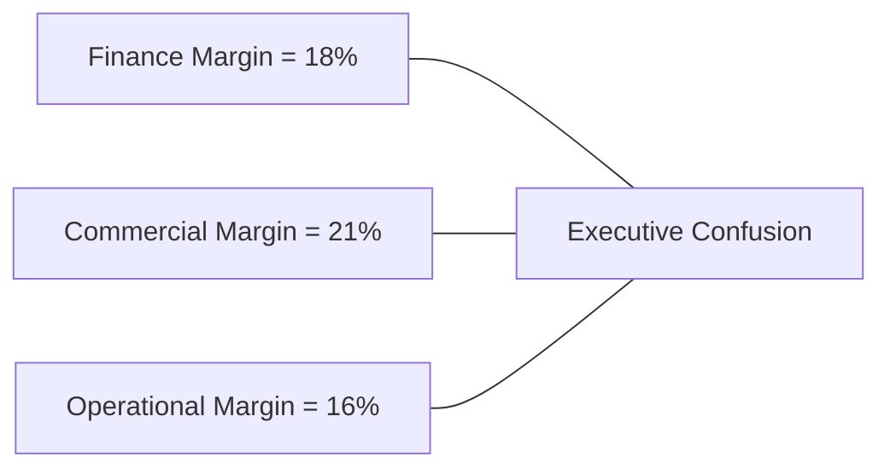
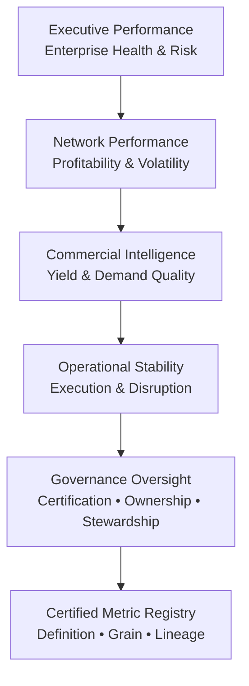
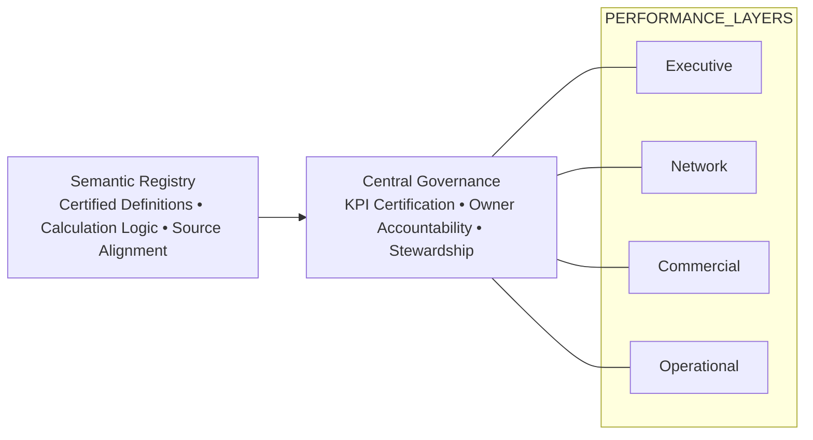

# ✈️ Federated Analytics & Governance  
## 🏛️ Making Enterprise Metrics Work in the Real World

---

## 🎯 1. Why This Presentation Exists

Most organizations don’t struggle because they lack dashboards.

They struggle because they don’t fully trust the numbers on those dashboards.

Over time:

- Different teams define the same KPI differently  
- Finance and Commercial disagree on margin  
- Operations optimizes metrics that don’t align with revenue  
- Reports multiply faster than definitions  
- Executives begin to question which number is “correct”  

This presentation explains a practical operating model designed to prevent that drift in a federated analytics environment.

---

## 🧭 2. What “Federated Analytics” Really Means

Federated analytics simply means:

Different teams own different domains.

- Commercial owns revenue behavior  
- Finance owns cost and profitability  
- Operations owns reliability and service performance  
- Network teams own route economics  

That ownership is healthy.

It allows domain depth, faster decision-making, and subject matter expertise.

But autonomy without alignment creates inconsistency.

Federated does not mean fragmented.

---

## ⚠️ 3. What Goes Wrong Without Governance

When definitions are not controlled centrally, the same KPI can evolve differently across domains.

No one is wrong.

Each team calculates based on its own view.

But at the executive level, conflicting metrics reduce confidence and slow decisions.

Over time, trust erodes.

---

## 🛡️ 4. What Governance Actually Means

Governance is often misunderstood.

It is not bureaucracy.  
It is not documentation for its own sake.

At its simplest, governance means:

- One agreed definition  
- One accountable owner  
- One steward responsible for data integrity  
- One certified source  
- One known refresh schedule  

If these elements are unclear, the metric is not governed.

---

## 🏗️ 5. The Federated Operating Model

This model separates domain insight while anchoring everything to shared governance.

Each domain goes deep.

Governance ensures they remain aligned.

All metrics resolve back to a certified registry.

---

## 🔄 6. Governance as an Overlay

Governance is not a separate reporting layer.

It operates across every domain at the same time.

This ensures:

- Definitions do not drift  
- Calculation logic remains consistent  
- Grain mismatches are prevented  
- Certification status is visible  
- Data freshness is tracked  

Governance becomes operational, not theoretical.

---

## 👤 7. Ownership vs Stewardship

A key part of realistic governance is role clarity.

Each KPI has:

### KPI Owner  
Usually the functional head.  
Accountable for the business definition and final approval.

### Data Steward  
Typically the lead analyst within that function.  
Responsible for working with data engineering, validating logic, and ensuring ongoing data quality.

This separation reflects how mature analytics organizations operate.

It aligns with widely accepted data management principles:

- Clear accountability  
- Defined stewardship  
- Business ownership of meaning  
- Operational ownership of quality  

---

## 📊 8. Data Quality in Practical Terms

Governance extends beyond definition.

A KPI is only governed if we know:

- Where it comes from  
- How it is calculated  
- How often it refreshes  
- Who maintains it  
- Whether quality rules exist

If any of these are unclear, the metric carries risk.

This is not about perfection.

It is about transparency and control.

---

## 📚 9. Alignment with Enterprise Data Management Principles

This model aligns with established governance principles, including:

- Clear role-based accountability  
- Business metadata transparency  
- Controlled calculation logic  
- Grain discipline (Daily / Monthly / Composite)  
- Data quality rule visibility  
- Refresh SLA tracking  
- Lightweight lineage documentation  

It is not a theoretical framework.

It is governance embedded into daily analytics operations.

---

## 🚀 10. What This Changes

Without governance:

- Teams move fast  
- Definitions drift  
- Executive confidence declines  

With governance:

- Teams still move fast  
- Definitions remain consistent  
- Executive confidence scales with complexity  

Federation becomes an advantage instead of a liability.

---

## 🏢 11. Why This Matters for Leadership

In federated environments, complexity increases naturally.

More domains.  
More analysts.  
More dashboards.  
More metrics.

The real challenge is not building reports.

It is preserving integrity as scale increases.

Designing a governance-driven federated model requires balancing:

- Autonomy and control  
- Speed and discipline  
- Depth and alignment  

This project demonstrates that balance in practice.

---

## 💡 12. Closing Thought

Governance is not about restricting analytics.

It is about protecting decision quality in environments where insight is distributed.

In federated organizations, governance is not optional.

It is structural.

And when designed correctly, it becomes invisible — because the numbers simply make sense.
