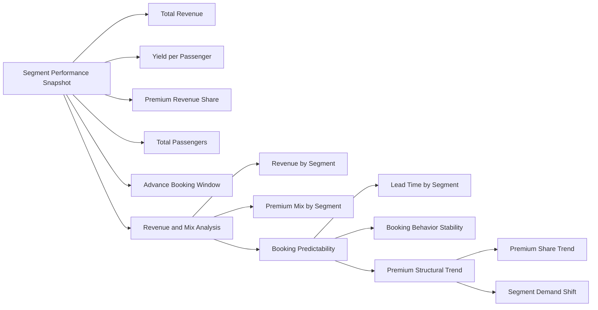

# Enterprise Airline Analytics — Customer & Commercial Intelligence Architecture

The Customer & Commercial Intelligence dashboard represents the enterprise segmentation layer of the airline analytics stack.

This page connects customer behavior, revenue quality, and booking predictability to network performance and profitability outcomes.

It enables federated insight across commercial, network planning, and executive decision layers.

---

## 1. Objective

Provide enterprise visibility into:

- Segment-level revenue contribution
- Yield quality and premium concentration
- Booking behavior predictability
- Structural demand shifts over time

This dashboard bridges customer analytics with strategic network and financial outcomes.

---

## 2. Primary Business Questions

This page answers:

- Which customer segments drive sustainable margin?
- How does revenue quality vary across segments?
- Which segments improve demand predictability?
- Is premium demand structurally shifting over time?

---

## 3. Page Architecture

---

## 4. Section Breakdown

### 4.1 Segment Performance Snapshot

**Purpose:**

Provide a consolidated view of revenue contribution, yield strength, and booking behavior across customer segments.

This establishes segment-level value and structural demand quality.

---

### 4.2 Revenue & Mix Analysis

**Purpose:**

Evaluate revenue concentration and premium mix across segments to identify structurally higher-margin customer groups.

This supports pricing and capacity allocation decisions.

---

### 4.3 Booking Predictability

**Purpose:**

Analyze advance booking window differences to assess revenue visibility and demand stability by segment.

This informs forecasting confidence and planning reliability.

---

### 4.4 Premium Structural Trend

**Purpose:**

Track evolution of premium revenue share across segments to detect long-term shifts in customer mix and profitability drivers.

This supports strategic commercial repositioning.

---

## 5. Slicer Discipline

Included:

- Year
- Route
- Segment

Excluded:

- Aircraft
- Operational performance metrics

Rationale:

This dashboard focuses on commercial intelligence. Operational diagnostics belong to the Operational Insight layer.

---

## 6. Enterprise Positioning

This dashboard represents the commercial analytics layer within the federated enterprise model.

It integrates with:

- Executive Dashboard (enterprise performance)
- Route Analytics (network planning)
- Operational Insight (execution stability)
- KPI Governance (metric certification)

It demonstrates how customer segmentation informs enterprise-level strategy rather than isolated marketing reporting.
