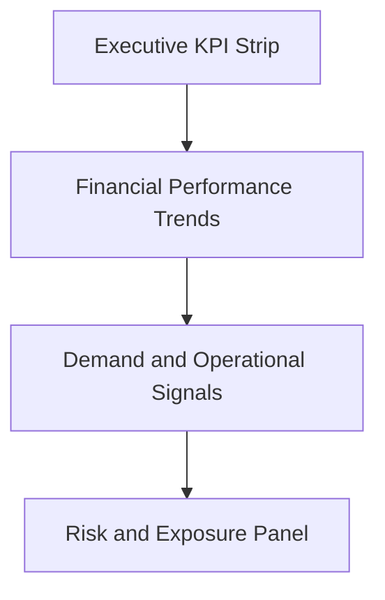

# Enterprise Airline Analytics — Executive Dashboard (C-Suite View)

## 1. Objective

This Executive Dashboard is designed to provide airline leadership with an immediate, high-signal view of:

- Financial performance
- Demand trajectory
- Operational stability
- Strategic risk exposure

The page prioritizes clarity, trajectory, and decision-enabling insight over visual density.

It is intentionally designed for C-suite consumption — not operational analysts.

---

## 2. Executive Questions Addressed

This page answers four critical leadership questions:

1. Are we generating sustainable profit?
2. Is demand accelerating or decelerating?
3. Is operational performance stable?
4. Where is financial or operational risk accumulating?

The dashboard architecture reflects this decision hierarchy.

---

## 3. Page Architecture

### Architecture Logic

The page follows a structured vertical decision flow:

1. Performance Snapshot  
2. Trend Trajectory  
3. Demand & Execution Signals  
4. Risk & Exposure  

This mirrors how executive discussions typically unfold.

---

## 4. KPI Selection Rationale

### Executive KPI Strip

- **Total Revenue**
- **Route Profit**
- **Profit Margin %**
- **Revenue Forecast Accuracy %**
- **Demand Momentum Index**

These metrics balance:

- Top-line performance
- Bottom-line sustainability
- Predictability credibility
- Forward-looking demand signals

---

### Financial Performance Section

**Visuals:**
- Revenue vs Operating Cost (Monthly Trend)
- Profit Margin Trend

**Purpose:**
- Expose cost shocks (e.g., fuel volatility)
- Highlight margin compression
- Surface seasonality patterns
- Reveal structural recovery trends

---

### Demand & Operational Signals

**Metrics:**
- Demand Momentum Index (Rolling 3M Growth)
- Load Factor %
- On-Time Departure %
- Cancellation Rate %

**Purpose:**
- Identify acceleration or deceleration in demand
- Surface operational reliability
- Link execution quality to financial outcomes

---

### Risk & Exposure Panel

**Metrics:**
- Route Risk Score (Composite Volatility Index)
- Fuel Cost Ratio
- Route-Level Profit Snapshot

**Purpose:**
- Highlight unstable or margin-sensitive routes
- Surface volatility exposure
- Enable risk-adjusted network discussions

---

## 5. Slicer Discipline

Included:

- Year
- Route

Excluded:

- Fare Class
- Customer Segment
- Aircraft Type

### Rationale

The C-suite view must remain strategic, not tactical.

Granular slicing belongs on drill-down analytical pages.  
The executive page is for directional clarity, not micro-analysis.

---

## 6. Executive Narrative Enabled

This dashboard enables leadership to articulate:

- Margin compression during fuel volatility
- Demand acceleration patterns across seasons
- Forecast model maturity improvement over time
- Route-level financial instability
- Operational reliability vs financial outcomes

The page supports board-level storytelling, not exploratory analysis.

---

## 7. What This Executive View Intentionally Does NOT Show

This page deliberately avoids:

- Detailed fare-class breakdowns  
- Segment-level slicing  
- Aircraft-level operational metrics  
- Pie charts or distribution-heavy visuals  
- Daily-level volatility views  

### Why?

- Executives require trajectory and exposure — not fragmentation.
- Too many slicers dilute signal clarity.
- Composite risk metrics are preferred over multiple disconnected indicators.
- Rolling metrics are preferred over raw daily data.

The design enforces decision discipline.

---

## 8. Alignment to Analytics CoE Principles

This Executive Dashboard reflects:

- Conformed dimensional modeling
- Multi-grain semantic architecture
- Certified KPI governance framework
- Forward-looking predictive indicators
- Volatility-based risk modeling
- Clean measure taxonomy
- Intentional slicer discipline

It demonstrates enterprise analytics design — not dashboard assembly.

---

## 9. Strategic Positioning of This Page

This dashboard represents:

- An Executive Decision Support Layer
- Built on a governed semantic model
- Supported by a KPI registry
- Backed by predictive indicators
- Structured for risk-adjusted evaluation

It mirrors how an Analytics Center of Excellence would design leadership-facing insight platforms.
