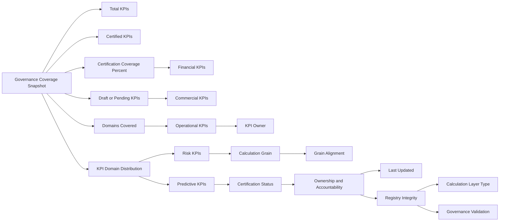

# Enterprise Airline Analytics — KPI Governance & Analytics CoE Architecture

The KPI Governance & Analytics CoE dashboard represents the oversight layer of the airline analytics stack.

This page provides executive visibility into governance maturity while enabling operational control over metric certification, ownership, and semantic integrity.

It ensures that financial, commercial, operational, and predictive KPIs are standardized, certified, and aligned within a federated enterprise model.

---

## 1. Objective

Provide enterprise visibility into:

- KPI certification coverage  
- Domain-level metric distribution  
- Ownership accountability  
- Calculation grain alignment  
- Registry integrity and governance maturity  

This dashboard bridges executive oversight with operational analytics control.

---

## 2. Primary Business Questions

This page answers:

- What percentage of KPIs are formally certified?  
- Are metrics consistently governed across enterprise domains?  
- Who owns each KPI and what is its calculation grain?  
- Are draft or uncertified metrics present in reporting layers?  
- Is there any cross-grain ambiguity within the semantic model?  

---

## 3. Page Architecture

---

## 4. Section Breakdown

### 4.1 Governance Coverage Snapshot

**Purpose:**

Provides executive visibility into governance maturity by summarizing KPI certification coverage and enterprise domain representation.

This section establishes whether analytics outputs are standardized, controlled, and production-ready.

---

### 4.2 KPI Domain Distribution

**Purpose:**

Evaluates KPI balance across financial, commercial, operational, predictive, and risk domains.

This ensures governance discipline is applied consistently across the enterprise rather than concentrated in a single function.

---

### 4.3 Ownership & Accountability

**Purpose:**

Surfaces metric ownership, certification status, and calculation grain to enforce accountability and semantic consistency.

This section supports operational control within the Analytics Center of Excellence.

---

### 4.4 Registry Integrity & Grain Alignment

**Purpose:**

Validates calculation grain alignment and registry integrity to prevent cross-grain ambiguity, duplication, and inconsistent reporting. 

This reinforces semantic discipline across the federate analytics environment 

---

## 5. Slicer Discipline

Included:

Domain

Certification Status

KPI Owner

Excluded:

Route

Customer Segment

Operational metrics

Rationale:

This dashboard focuses strictly on governance oversight and metric control rather than performance analysis.

---

## 6. Design Philosophy

Governance transparency over visual density

Certification clarity and accountability

Semantic grain validation

Domain balance monitoring

Federated oversight integration

This page prioritizes structure, neutrality, and auditability.

---

## 7. Enterprise Positioning

The KPI Governance & Analytics CoE dashboard represents the oversight layer within the federated airline analytics architecture.

It integrates with:

Executive Overview (enterprise performance monitoring)

Route & Network Analytics (profitability and risk diagnostics)

Customer & Commercial Intelligence (demand quality and predictability)

Operational Insight (execution stability)

This page demonstrates formal governance maturity, semantic control, and enterprise-wide KPI standardization within a compact analytics warehouse simulation

---