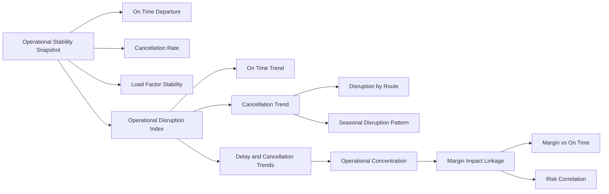

# Enterprise Airline Analytics — Operational Insight & Execution Stability Architecture

The Operational Insight dashboard represents the execution control layer of the airline analytics stack.

This page evaluates operational reliability, disruption concentration, and the financial impact of execution instability across the network.

It connects operational performance to profitability and enterprise risk exposure within a federated analytics model.

---

## 1. Objective

Provide enterprise visibility into:

- Execution reliability across routes  
- Structural delay and cancellation patterns  
- Concentration of operational instability  
- Financial impact of operational disruption  

This dashboard bridges operational performance with route profitability and executive risk monitoring.

---

## 2. Primary Business Questions

This page answers:

- Is operational execution stable across the network?  
- Where are delays or cancellations structurally concentrated?  
- Are disruptions seasonal or systemic?  
- Is operational instability eroding route profitability?  

---

## 3. Page Architecture

---

## 4. Section Breakdown

### 4.1 Operational Stability Snapshot

**Metrics:**

- On-Time Departure %
- Cancellation Rate %
- Load Factor %
- Operational Disruption Index (composite)

**Purpose:**

Consolidate core reliability indicators to provide an immediate assessment of execution discipline and service stability across the network.

This establishes whether operational performance is stable, deteriorating, or recovering.

---

### 4.2 Delay & Cancellation Trends

**Visuals:**

- Monthly On-Time Departure Trend
- Monthly Cancellation Rate Trend

**Purpose:**

Highlight structural changes in reliability over time and identify seasonal or persistent disruption patterns.

This section distinguishes short-term volatility from systemic instability.

---

### 4.3 Operational Concentration

**Visuals:**

- Disruption by Route (Bar Chart)
- Seasonal Disruption Pattern (Optional heatmap or monthly comparison)

**Purpose:**

Identify routes or periods exhibiting disproportionate operational instability.

This enables targeted operational intervention rather than network-wide assumptions.

---

### 4.4 Margin Impact Linkage

**Visual:**

Scatter Plot

- X-axis: On-Time Departure %
- Y-axis: Profit Margin %
- Size: Total Revenue
- Legend: Route

**Purpose:**

Evaluate the relationship between execution reliability and financial performance.

This section demonstrates whether operational instability materially affects route-level profitability and risk exposure.

---

## 5. Slicer Discipline

**Included:**

- Year
- Route

**Optional:**

- Season

**Excluded:**

- Customer Segment (belongs to Commercial Intelligence layer)
- Financial cost breakdown (belongs to Route Analytics layer)

**Rationale:**

This dashboard focuses strictly on execution stability and its financial linkage within the enterprise stack.

---

## 6. Design Philosophy

- Execution reliability evaluated at network level  
- Volatility separated from structural instability  
- Financial linkage explicitly demonstrated  
- Composite disruption index aligned with KPI governance  
- Clear domain separation within federated architecture  

This ensures operational analytics does not become isolated from enterprise financial outcomes.

---

## 7. Enterprise Positioning

The Operational Insight dashboard represents the execution control layer of the airline analytics environment.

It integrates with:

- Executive Overview (enterprise performance pulse)
- Route & Network Analytics (profitability and risk diagnostics)
- Customer & Commercial Intelligence (demand predictability)
- KPI Governance (metric certification and ownership)

This page demonstrates how operational stability influences profitability, demand confidence, and executive risk management within a federated enterprise model.