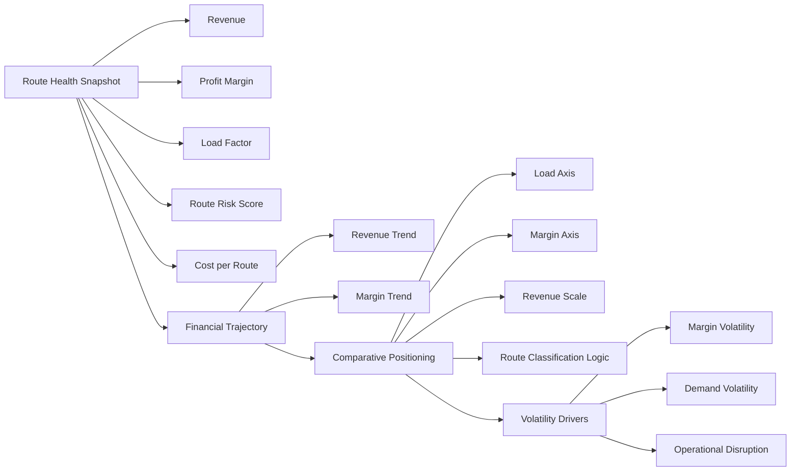

# Enterprise Airline Analytics — Route & Network Analytics Architecture

The Route & Network Analytics dashboard provides a strategic diagnostic layer focused on route-level profitability, demand efficiency, and structural volatility.

This page supports network planning, fleet allocation, and capacity optimization decisions by surfacing comparative route performance and instability drivers.

---

## 1. Objective

Enable route-level evaluation of:

- Financial contribution
- Demand strength
- Margin stability
- Volatility exposure

This dashboard transitions from executive signal to actionable diagnostic insight.

---

## 2. Primary Business Questions

This page answers:

- Which routes drive sustainable profitability?
- Where is margin compressing despite strong demand?
- Which routes exhibit elevated volatility?
- Where should capacity be optimized or reallocated?

---

## 3. Page Architecture

### Architecture Logic

The layout follows a diagnostic progression:

1. Route Snapshot  
2. Financial Trajectory  
3. Comparative Positioning  
4. Volatility Decomposition  

This mirrors how network planning discussions evolve from summary to root-cause analysis.

---

## 4. Section Breakdown

### 4.1 Route Health Snapshot

**Metrics:**

- Total Revenue  
- Profit Margin %  
- Load Factor %  
- Route Risk Score  
- Cost per Route  

**Purpose:**

Provide a consolidated health view of the selected route combining profitability, demand efficiency, and structural risk exposure.

---

### 4.2 Revenue & Margin Trend

**Visual:**

Monthly Revenue and Profit Margin Trend

**Purpose:**

Highlight structural revenue progression and margin compression across seasonal demand cycles and fuel volatility impacts.

This section reveals whether profitability is improving, deteriorating, or structurally constrained.

---

### 4.3 Performance Quadrant

**Visual:**

Scatter Plot

- X-axis: Load Factor %
- Y-axis: Profit Margin %
- Size: Total Revenue
- Legend: Route

**Purpose:**

Position routes by demand efficiency and profitability to identify:

- Core performers (High Load, High Margin)
- Cost-constrained routes (High Load, Low Margin)
- Niche premium routes (Low Load, High Margin)
- Structurally weak routes (Low Load, Low Margin)

This enables capacity optimization and pricing strategy evaluation.

---

### 4.4 Risk & Volatility Breakdown

**Metrics:**

- Margin Std Dev
- Load Factor Std Dev
- Average Cancellation Rate

**Purpose:**

Deconstruct the components driving Route Risk Score and identify the primary sources of structural instability.

This allows leadership to distinguish between financial volatility, demand variability, and operational disruption risk.

---

## 5. Slicer Discipline

Included:

- Route
- Year

Excluded:

- Fare Class
- Customer Segment
- Aircraft Type

Rationale:

This dashboard is network-level and strategic. Granular commercial or operational slicing belongs to dedicated domain dashboards.

---

## 6. Design Philosophy

- Comparative analysis over descriptive reporting
- Volatility-based risk modeling
- Consistent KPI definitions governed by Dim_KPI_Definitions
- Minimal visual clutter
- Structured diagnostic progression

---

## 7. Enterprise Positioning

The Route & Network Analytics dashboard represents the strategic planning layer of the airline analytics stack.

It bridges executive performance monitoring with operational and commercial deep dives.

This design mirrors real-world airline network planning environments while remaining compact and model-governed.
